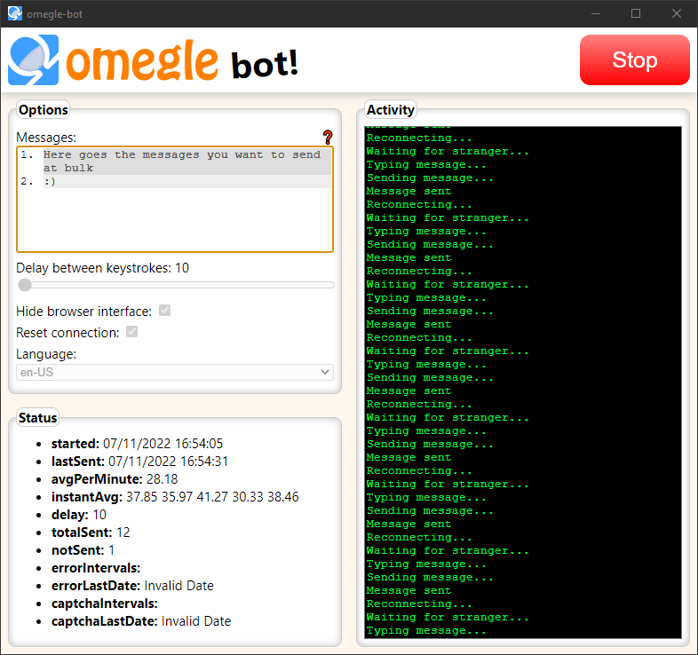

#  Omegle-Bot [](LICENSE.txt)


### Description:
Application to send messages to strangers at bulk, this is the only omegle bot with GUI 💻🖱️ (at least the only I could find🔍🔍🚫)


### Functionality:
The bot is fully functional✅, being capable of sending messages at bulk 💬, and solve captchas to keep doing it's work for a longer period of time 🤖⏱, the only annoyance that you will have using it is the Omegle's bot detection that is pretty good 😒🤦‍♂️😥. The maximum running time achieved by me was 3 days ⌛⌛⌛, but the usual is several hours 🤔.
#
### Goals:
This project was done with the purpose of learning new coding skills  👨‍💻🐱‍💻🚀🔍🎓🤓, it's the first project I have ever done using Electron JS framework 🏆.
#
### Usage:  
1. Get the dependencies: ⬇️📚
```
npm i
```  
2. Start the application: ✨
```
npm start
```
3. Type whatever messages you want to send ⌨️
4. Set the delay between keystrokes speed ⏩🏃‍♂️
5. Choose the language you want 🗺️👅🗣️
6. Click the start button ▶️🖱️
#
### Troubleshot:   
* Restart your internet connection (change your ip address).🌐↔️🕸️📬
* Change the messages: some words or whole phrases can be blocked by Omegle. ❗❓❔❕
* A higher delay can lead to a higher running time without interventions. 🔧⚒️⚙️📈
* Not all languages were tested, this can lead the bot to work in English whatever the selected language.🤐❌
* Running the bot with the browser interface visible can lead to errors (This option was made only to watch and not to interact).⌚🚫👈
#
### GUI status information meaning:
*  **started:** Last time bot started.
*  **lastSent:** Last time a message was sent.
*  **avgPerMinute:** Average of messages sent per minute since started.
* **instantAvg:** Average per minute considering time between the five last messages sent.
* **delay:** Delay between keystrokes in milliseconds.
* **totalSent:** Messages sent since started.
* **notSent:** Amount of times that not all messages set were sent.
* **errorIntervals:** Last five intervals between errors in minutes, from first to last.
* **errorLastDate:** Last time an error occurred.
* **captchaIntervals:** Last five intervals between captchas solved in minutes, from first to last.
* **captchaLastDate:** Last time a was captcha solved.
#
List of available chat languages (Not all of them were tested, try your lucky🤞🥠🍀):  

    "af", "ar-AE", "ar-BH", "ar-DZ", "ar-EG", "ar-IQ", "ar-JO", "ar-KW", "ar-LB", "ar-LY", "ar-MA", "ar-OM", "ar-QA", "ar-SA", "ar-SY", "ar-TN", "ar-YE", "be", "bg", "ca", "cs", "da", "de", "de-AT", "de-CH", "de-LI", "de-LU", "el", "en", "en-AU", "en-BZ", "en-CA", "en-EG", "en-GB", "en-IE", "en-JM", "en-NZ", "en-TT", "en-US", "en-ZA", "es", "es-AR", "es-BO", "es-CL", "es-CO", "es-CR", "es-DO", "es-EC", "es-GT", "es-HN", "es-MX", "es-NI", "es-PA", "es-PE", "es-PR", "es-PY", "es-SV", "es-UY", "es-VE", "et", "eu", "fa", "fi", "fo", "fr", "fr-BE", "fr-CA", "fr-CH", "fr-LU", "gd", "gd-IE", "he", "hi", "hr", "hu", "id", "is", "it", "it-CH", "ja", "ji", "ko", "lt", "lv", "mk", "mt", "nl", "nl-BE", "no", "pl", "pt", "pt-BR", "rm", "ro", "ro-MO", "ru", "ru-MI", "sb", "sk", "sl", "sq", "sr", "sv", "sv-FI", "sx", "sz", "th", "tn", "tr", "ts", "uk", "ur", "ve", "vi", "xh", "zh-CN", "zh-HK", "zh-SG", "zh-TW", "zu", 
